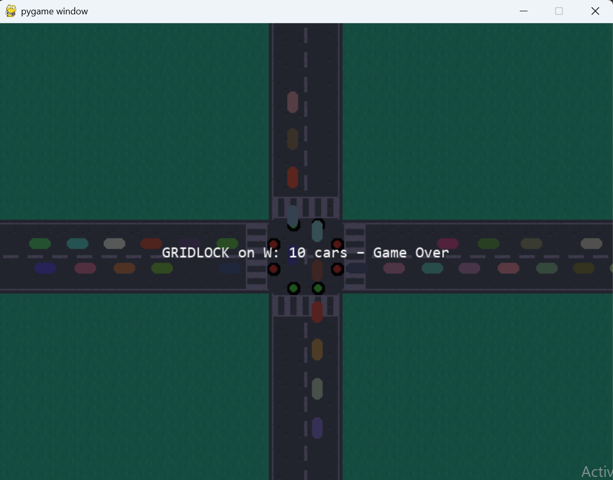

## Chomp_ay26
    -ew200 in-class project

# Traffic Simulator 
## (How To Play):
1) Control the lights with the `Space` bar
2) Your goal is to get the cars across the screen without crashing
3) If you have more than 10 cars at a light you lose
4) If you crash in the interesection you get Gridlocked and lose
5) Every 50 points an ambulance spawns and gives you an extra 5 points. You use the `W` key to move it up north.
## Game Screenshots
title screen:

gameplay:

deathscreen (if crashed):

deathscreen (if to many cars):

